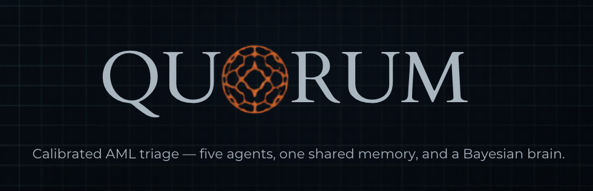
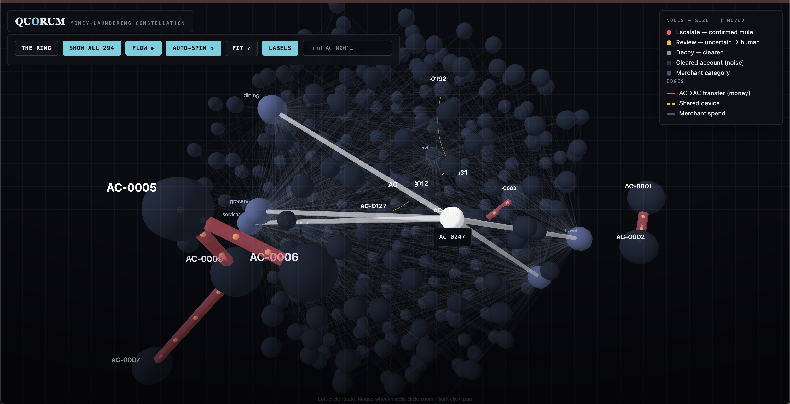
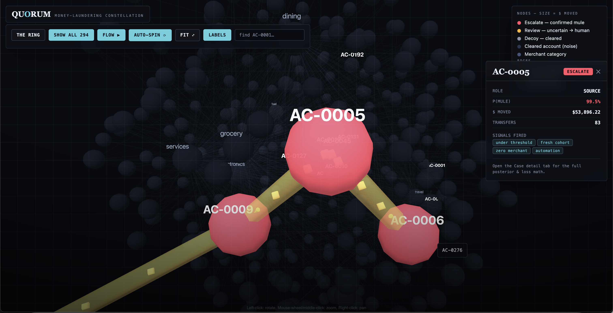
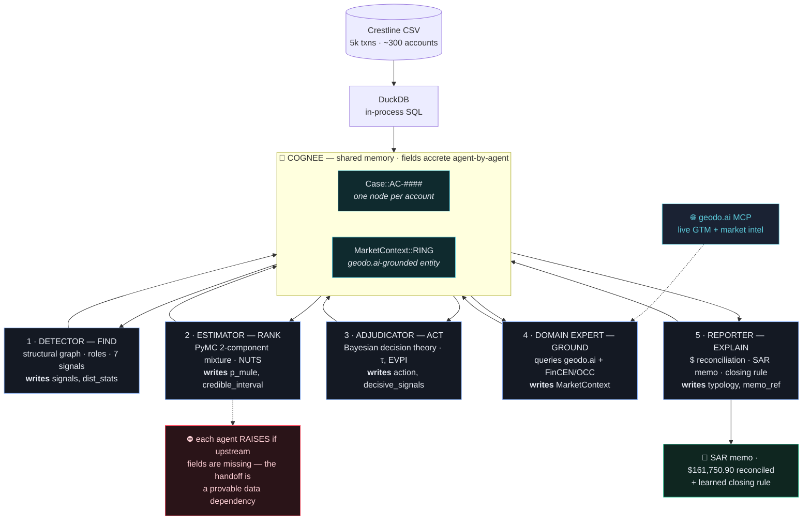
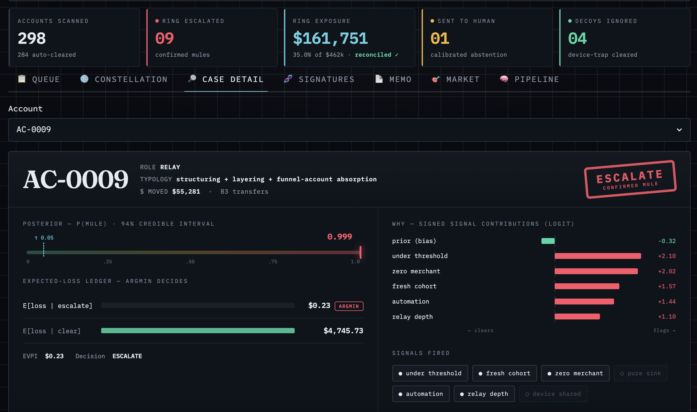
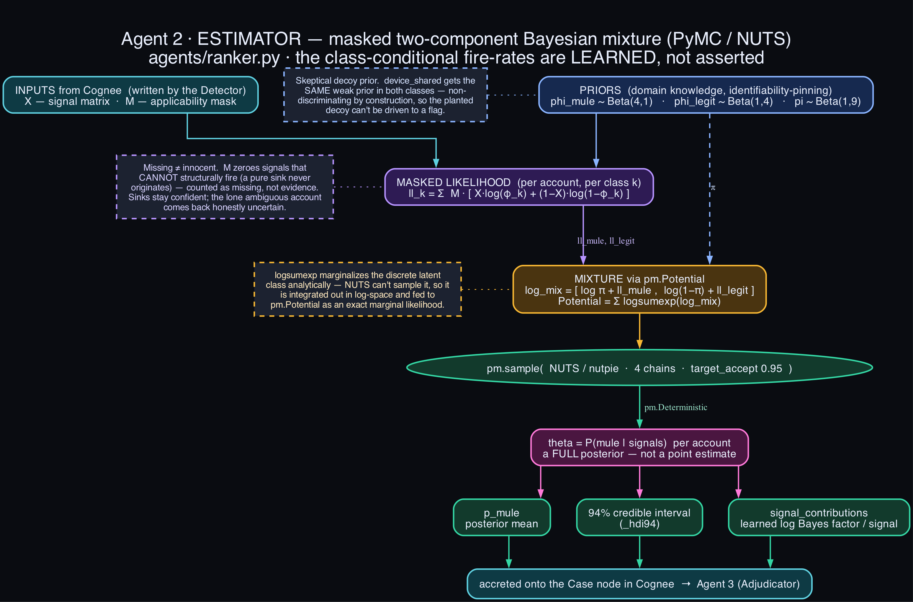
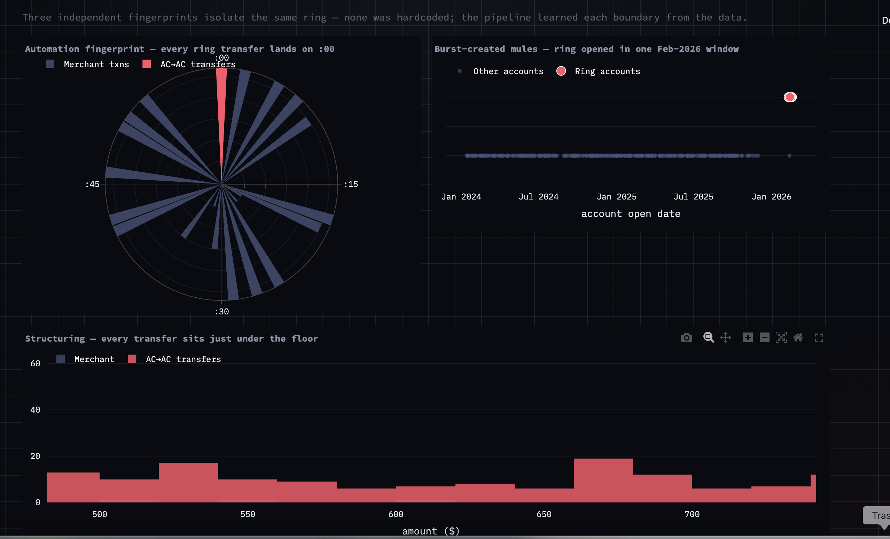
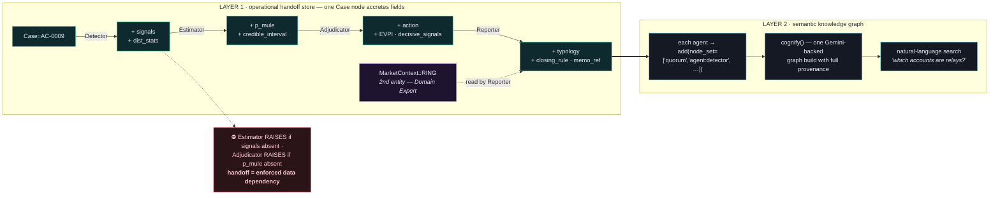
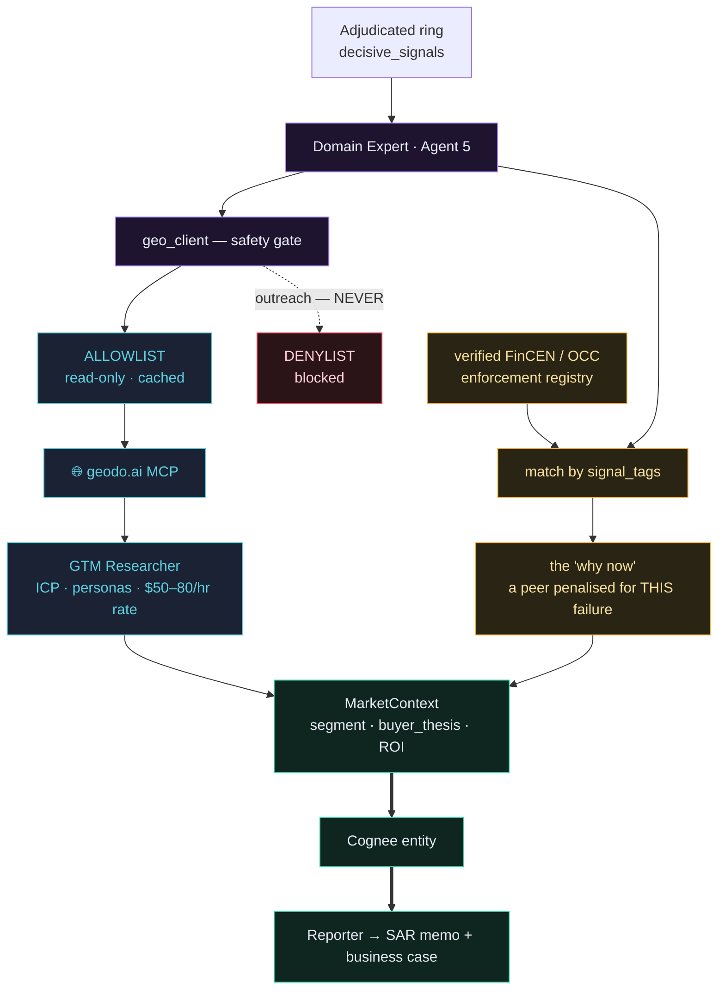
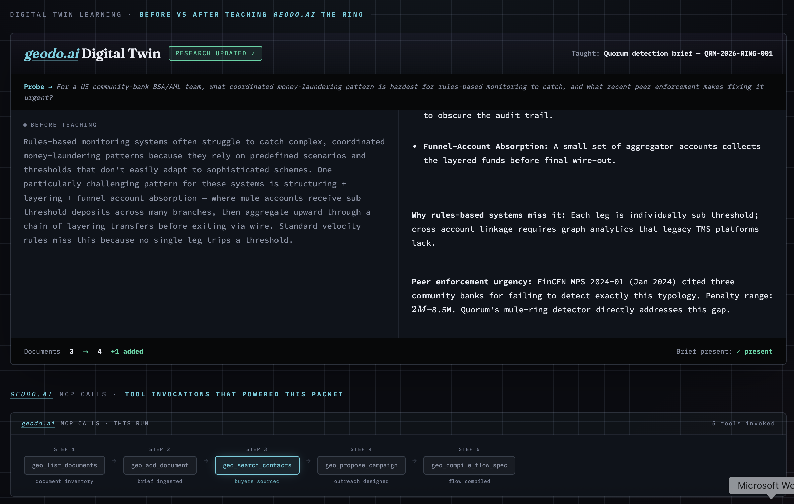

<!-- ░░░ HERO ░░░ -->
<p align="center">
  
</p>

<h1 align="center">Quorum</h1>

<p align="center">
  <b>Calibrated anti-money-laundering triage.</b><br/>
  <i>Five agents. One shared memory. A real Bayesian brain — and the math behind every call.</i>
</p>

<p align="center">
  
  
  
  
  
</p>

<!-- Once your app is live, replace the link below with your https://<name>.streamlit.app URL -->
<p align="center">
  <a href="https://share.streamlit.io/deploy?repository=Alred-79/nycTechWeekHack&branch=main&mainModule=ui/app.py">
    
  </a>
</p>

---

## The problem, in one breath

Every year an estimated **\$800B–\$2T** is washed through the banking system — ~**2–5% of world GDP** — and **less than 1%** is ever caught. The hard cases don't look like crime. They look like **boredom**: dozens of fresh accounts moving money *just under* every reporting threshold, fanning it through relays, pooling it in a quiet sink. Rules engines drown the analyst in false positives and still miss the ring. The analyst has **three minutes a case**.

**Quorum finds the ring, refuses to guess on the one genuinely ambiguous account, ignores the planted decoy — and shows its arithmetic for every decision.**

<!-- ░░░ THE HAYSTACK ░░░ -->
<p align="center">
  
</p>
<p align="center"><sub><b>The haystack.</b> 5,000 transactions · 294 accounts. The dim cloud is normal banking; the red chains are the laundering ring — money-flow edges lit. Fully interactive: open <code>ui/quorum_constellation.html</code> in any browser (no server, no internet).</sub></p>

<!-- ░░░ THE NEEDLE ░░░ -->
<p align="center">
  
</p>
<p align="center"><sub><b>The needle.</b> Click any node and the case opens inline — role, posterior, dollars, signals fired. Here the source pumps <b>\$53,896</b> across 83 transfers into two relays at <b>p = 99.5%</b>.</sub></p>

---

## Architecture — a real pipeline, not one LLM in a loop

Five specialist agents in a **Find → Rank → Act → Ground → Explain** relay. They never call each other — every handoff goes **through Cognee**: each agent *accretes* fields onto a shared `Case` node, and **the next agent refuses to run if the upstream fields are missing.** Collaboration is a hard data dependency, not a vibe.



<!-- ░░░ THE PAYOFF ░░░ -->
<p align="center">
  
</p>
<p align="center"><sub>~300 accounts → a queue of 14 in under a second. Every verdict carries its posterior, its expected-loss ledger (<b>argmin decides</b>), its signed signal contributions, and a decision log. No bare score anywhere.</sub></p>

---

## Three pillars

### 🧠 PyMC — a probabilistic brain, not a scorecard

The data has **no labels**, so the Estimator doesn't classify — it *infers*. It posits two latent classes (**legit** vs **mule**), each with its own vector of signal fire-rates `φ`, and lets **PyMC's NUTS sampler (`nutpie`, 4 chains)** learn the rates, the mixing weight, and every account's posterior probability of being a mule — with an honest credible interval.

<p align="center">
  
</p>

Three pieces of real Bayesian engineering — each is why a demo moment lands:

- **`logsumexp` marginalizes the hidden class analytically.** NUTS can't sample discrete latents, so the class is integrated out in log-space and fed to `pm.Potential` as an exact marginal log-likelihood — the textbook-correct way to fit a mixture under HMC (R-hat + divergences checked every run).
- **A masked likelihood: missing ≠ innocent.** A pure *sink* physically cannot fire `automation` or `fresh_cohort`; an applicability mask `M` zeroes those out so they count as **missing data, not evidence of innocence**. That's why sinks stay confident *and* why the lone ambiguous account comes back honestly uncertain with a wide, τ-straddling interval.
- **A skeptical decoy prior.** `device_shared` gets the **same weak prior in both classes** — identity co-occurrence is non-discriminating *by construction*, so the planted decoy can't be driven to a flag. Decoy resistance is a property of the model, not an `if` statement.

The Adjudicator turns that posterior into a **cost-optimal action** — never a bare threshold:

```
τ = C_FP / (C_FP + C_FN) = 250 / (250 + 4750) = 0.05
abstain → REVIEW  ⟺  the 94% interval straddles τ  AND  EVPI > review cost
```

Every signal is **learned from the data**, not hardcoded — and the Detector's three independent fingerprints all isolate the *same* ring:

<p align="center">
  
</p>

### 🕸️ Cognee — the memory that makes the collaboration real

Two layers: an **operational handoff store** where one `Case` node accretes fields agent-by-agent (and a downstream agent throws if the upstream fields are absent), and a **semantic knowledge graph** where every agent contributes a tagged layer and a single `cognify()` builds a Gemini-backed graph carrying full multi-agent provenance — queryable in plain English. It degrades gracefully to the fast local store with no key, so the pipeline is never blocked.



### 🌐 Geodo — grounding the verdict in the real market

The **Domain Expert (Agent 5)** reads the ring's `decisive_signals` and queries the live **[geodo.ai](https://geodo.ai) MCP** through a hard safety gate — read-only tools only, outreach permanently blocked. It pulls the segment, personas and labor-cost rate that source the cost matrix, then matches the ring to a **real, dated SAR-failure enforcement action** against a peer institution. One verified fact powers both the SAR memo and the business case, written into Cognee as `MarketContext`.



<p align="center">
  
</p>

---

## Stack & run

**Python 3.14 · `uv`** — `DuckDB` (in-process SQL) · **`PyMC` + `nutpie` + `ArviZ`** (the mixture & diagnostics) · **`Cognee`** (shared memory + cognified graph) · **`geodo.ai` MCP** (market grounding) · **`Streamlit`** (the analyst product).

```bash
uv sync
uv run streamlit run ui/app.py                 # the product — opens straight into the demo
uv run main.py data/track02_fraud_watch.csv    # the raw 5-agent pipeline, reasoning logged
```

External layers are **bring-your-own-key and degrade gracefully** — with no Gemini or geodo.ai key the pipeline still runs end-to-end from the committed snapshot and caches. Keys never touch the repo.

---

<p align="center">
  <b>Every other tool ranks risk — and most just flag the decoy.</b><br/>
  Quorum surfaces the nine, refuses to guess on the tenth, ignores the trap, and shows you the math behind every call.
</p>
